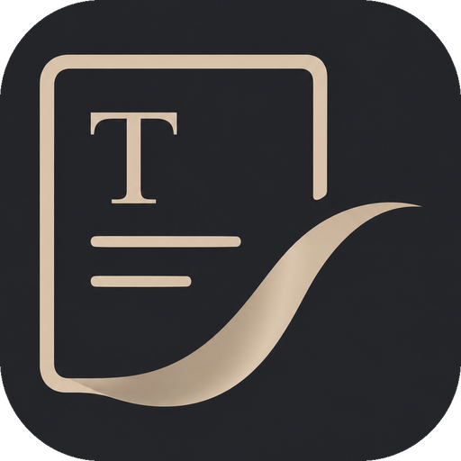

<p align="center">
  
</p>

<h1 align="center">Levis</h1>

<p align="center">
  <strong>A WYSIWYG Markdown editor — with an AI agent that quietly joins in.</strong><br>
  What you see is what you get; the agent helps only when it should, never in your way.
</p>

<p align="center">
  <a href="https://github.com/CatVinci-Studio/Levis/releases/latest"><strong>Download</strong></a> ·
  <a href="./README.zh.md">中文</a>
</p>

<p align="center">
  <a href="https://github.com/CatVinci-Studio/Levis/releases/latest"></a>
  
  <a href="./LICENSE"></a>
</p>

---

## What it is

Levis is a WYSIWYG Markdown editor with modern AI features built in — sentence completion, grammar checking, and asking questions about the document you have open.

## Why

Modern WYSIWYG Markdown editors tend to focus on content alone, without much in the way of modern writing assistance. A few problems stand out:

1. Editors like Typora use a lot of memory and feel slow.
2. Writing Markdown directly in VS Code or Neovim usually means a split preview pane rather than true WYSIWYG, which adds friction and makes it harder to stay focused.
3. Some AI agents have a very heavy presence while you edit, and end up getting in the way of your own judgment about your writing.

Levis is a WYSIWYG Markdown editor with AI assistance delivered as a plugin — there when it helps, invisible otherwise.

## Install

| Platform | Installer |
|---|---|
| macOS (Apple Silicon) | `Levis_X.Y.Z_aarch64.dmg` |
| Windows | `Levis_X.Y.Z_x64-setup.exe` (NSIS) · `_x64_en-US.msi` (WiX) |
| Linux | `Levis_X.Y.Z_amd64.AppImage` · `_amd64.deb` · `Levis-X.Y.Z-1.x86_64.rpm` |

→ Get the latest at [Releases](https://github.com/CatVinci-Studio/Levis/releases/latest). Builds are unsigned for now — first launch may need a right-click → Open on macOS, or "More info → Run anyway" on Windows SmartScreen.

## Quick start

1. Launch Levis — it opens straight into an editable blank draft, no file required until you save.
2. Open **Settings → AI**, pick a provider (ChatGPT, Claude, API key, or custom endpoint), and sign in / paste a key.
3. Toggle **AI completion** and **grammar check** in the same panel, or just start typing — suggestions show up as ghost text; press Tab to accept.

## Build from source

```bash
git clone https://github.com/CatVinci-Studio/Levis.git
cd Levis
npm install

npm run tauri dev     # full Tauri app (Rust shell + Vite renderer)
npm run tauri build   # bundle .dmg / .msi / .AppImage / .deb / .rpm
npm run build          # tsc --noEmit + vite build
```

Requires [Node.js](https://nodejs.org) 20+, [Rust](https://rustup.rs) (stable), and platform build tools (Xcode CLT on macOS; `libwebkit2gtk-4.1-dev`/`libappindicator3-dev`/`librsvg2-dev`/`patchelf` on Linux; MSVC Build Tools on Windows).

## License

[MIT](./LICENSE) © CatVinci Studio
