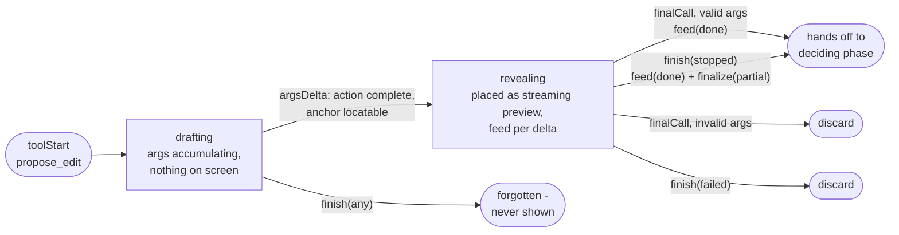
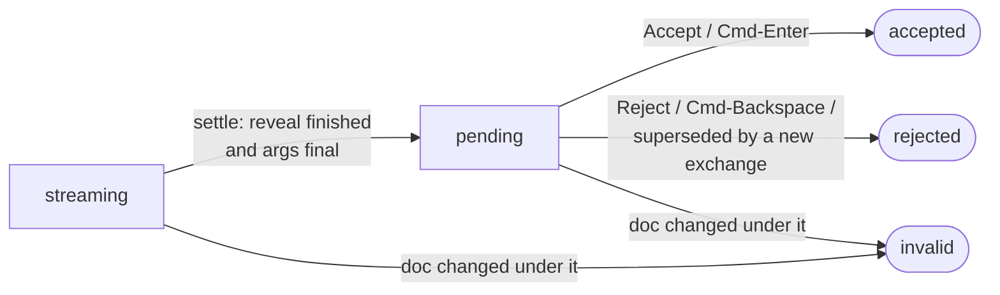

# AI proposals: lifecycle and behavior

How a `propose_edit` tool call travels from streamed arguments to text in the
document, what consecutive prompts do to undecided proposals, and what stop /
failure / close leave behind. Every rule here is enforced in code; the file
that owns each one is named so this document can be checked against reality.

## The surfaces, and the one path into the document

Chat has exactly two surfaces, split by **scope**:

- **Quick Ask** — the in-document bar. About one file, holding the
  document/selection snapshot captured when it opened (`ai/useInlineChat.ts`).
- **The detached chat window** — the cross-file surface. Follows the active
  document, one window per scope. It owns no document state: proposals and
  accept/reject travel over `ai/chat/chat-bridge.ts` back to the editor
  window.

Both render the same `ChatBody`, and both feed one resolution pipeline:
`MilkdownEditor → usePendingEdits → pending-edit-plugin`. Anchors resolve in
**markdown source space** (`ai/doc-markdown.ts`), matching what the model was
shown. Previews are pure decorations - until the user clicks Accept, the
document text is untouched. Accept (`applyEditRange`) is the **only** write
path: one transaction, one undo step, no direct-apply fallback.

## Writing phase: the `ProposalStream` machine

`ai/proposal-stream.ts` - plain logic, no ProseMirror dependency. Every
lifecycle decision for a streamed proposal lives here; `MilkdownEditor` only
wires the machine's effects to the editor (place → streaming preview, feed →
typewriter, finalize → decidable re-show, discard → reject).

`finish` fires when the exchange ends: a user stop is `"stopped"`, a request
failure is `"failed"`. A normal completion delivered a `finalCall` for every
draft, so the machine is already empty and `finish` is a no-op.

The two endings that matter:

- **Stop keeps.** A user stop freezes a revealing draft at the text streamed
  so far and re-shows it as an ordinary decidable preview. The user watched
  that content arrive; stopping means "that's enough", not "throw it away".
- **Failure discards.** The error path offers Retry, and a kept preview
  would duplicate the retried proposal.

Smaller rules the machine also owns:

- A textless proposal (`delete`) still gets its `feed(done)` - without it
  the typewriter entry stays "more may come" forever and the preview never
  becomes decidable.
- Final arguments that don't validate (e.g. `replace` without an anchor)
  discard the placed preview: such a proposal can never be applied, and
  leaving it would strand an un-decidable preview.
- With edit animation off (or reduced motion) the machine is bypassed
  entirely; proposals appear complete, at once, via `ChatBody`'s
  completed-turn batches.

## Deciding phase: `PendingStatus`

`ai/usePendingEdits.ts` + `ai/pending-edit-plugin.ts`.

| Status      | Meaning                                      | Behavior                                                                                                   |
| ----------- | -------------------------------------------- | ---------------------------------------------------------------------------------------------------------- |
| `streaming` | Args still arriving, or typewriter playing   | Accept refuses (not a failure - works once settled)                                                        |
| `pending`   | Decidable                                    | Strike (red) + new text (green); Quick Ask nav bar walks previews in **document order**, not arrival order |
| `accepted`  | Applied                                      | Decoration removed in the same transaction as the write - no orphan frame                                  |
| `rejected`  | Declined, or superseded                      | Preview removed; chat card shows Rejected                                                                  |
| `invalid`   | Target text changed / anchor no longer found | Preview dropped; chat card offers relocation (asks the model to re-issue against the current document)     |

Staleness mirrors the grammar checker: every `docChanged` maps each preview's
range through the transaction and re-checks its text - a mismatch drops the
preview rather than risk applying to the wrong text. Accept re-checks once
more, defensively. Terminal statuses are remembered even after the preview
leaves the document, so a chat card never regresses to a misleading
"Pending".

## Exchange boundaries: consecutive prompts

Four rules, one implementation point (`MilkdownEditor`'s `addPreviews`
wrapper plus a `supersedePending` flag):

1. **A new prompt supersedes.** The FIRST proposal a new exchange writes into
   the document first rejects every preview the user left undecided, then
   places itself. Old and new suggestions never stack.
2. **Question turns don't clear.** The flag is armed when an exchange starts
   and consumed by the first preview add - an exchange that proposes nothing
   leaves existing previews alone.
3. **Same-exchange proposals coexist.** The flag is consumed once; a second
   proposal in the same exchange lands beside the first.
4. **The model is told the truth.** Each send annotates every past
   `propose_edit` tool result in the history with its current status - see
   the next section.

Arming differs per surface: the embedded bar uses its own
`conversation.busy` rising edge; a detached send never flips that, so it arms
via `onContextRequest` - the fetch-fresh-document signal that precedes every
detached send.

## Conversation layer

`ai/useAgentConversation.ts`, `ai/cancelled-turns.ts`,
`ai/proposal-status.ts`; Rust side `src-tauri/src/ai/agent.rs` / `tools.rs`.

**Every send.** History travels to the backend in full; the document goes
into the system prompt as markdown source (long documents truncate to an
outline plus start/end - the model uses `search_document` for the middle).
The document contains **only accepted edits** - undecided previews are
decorations, absent from it. `annotateProposalStatuses` stamps each past
proposal's tool result with its current status (undecided / accepted /
rejected / invalid), computed fresh per send and never persisted; only call
ids present in the status map are touched, so other tools and
failed-validation proposals pass through unchanged. `agent.rs`'s
instructions tell the model to trust the notes, never anchor to undecided
text, and that proposing new edits replaces undecided ones automatically.

**Stop (user-initiated).** Everything that already streamed is kept: the
completed intermediate turns plus the cut-off reply (as a final Assistant
turn) enter history, saved and displayed like any completed exchange. A
ToolCall the stop left unanswered gets a synthetic result
(`STOPPED_TOOL_RESULT`) - providers reject a replayed history containing an
unanswered tool call. If nothing beyond the user's own message ever
streamed, the whole exchange is dropped (a user message with no reply at all
would read as the model ignoring it).

**Failure.** Sets `error` and `retryable`; Retry resends the same message
verbatim against the document it was composed for. Streamed half-finished
previews are rolled back (writing phase, above).

## Draft snapshots and closing

`draft-autosave.ts`, `startup-restore.ts`, `App.tsx`.

- **Writing.** A dirty tab's content snapshots to disk 3 s after typing
  settles, at most every 30 s during an unbroken burst. A tab that turns
  clean or leaves the tab list has its snapshot cleared.
- **Closing the last tab** ("Don't Save"): the window dies with it, so the
  autosave hook's cleanup effect never gets another run - `removeTab`
  cancels all scheduled snapshot writes and clears the tab's snapshot
  explicitly BEFORE destroying the window.
- **Closing the whole window** (save or discard): `clearWindowDrafts` also
  cancels scheduled writes first - otherwise a debounce timer firing between
  the clears and `destroy()` re-saves what was just deleted, resurrecting a
  discarded document as a "recovered draft". Only this window's tabs are
  cleared; other windows' drafts survive.
- **Startup**, in priority order: a tab dragged in from another window
  (short-circuits everything), recovered drafts (path-backed drafts whose
  disk content already matches are skipped; never steals focus), a Help doc
  this window was spawned for, OS-handed file paths, first-run onboarding.

## File index

| File                                                  | Owns                                                                       |
| ----------------------------------------------------- | -------------------------------------------------------------------------- |
| `ai/proposal-stream.ts`                               | Writing-phase machine: place/feed/finalize/discard                         |
| `ai/usePendingEdits.ts`                               | Anchor resolution, accept/reject/rejectAll, status map, review navigation  |
| `ai/pending-edit-plugin.ts`                           | Decorations, typewriter + settle, docChanged staleness, keyboard shortcuts |
| `ai/proposal-status.ts`                               | Status notes annotated onto history at send time                           |
| `ai/cancelled-turns.ts`                               | What a stop keeps; dangling tool-call closure                              |
| `ai/useAgentConversation.ts`                          | Conversation state: send/stop/retry/restore, history persistence           |
| `ai/chat/ChatBody.tsx`                                | Shared conversation UI; streamed-turn → proposal, idempotent afterSend     |
| `ai/chat/ChatWindowApp.tsx`, `ai/chat/chat-bridge.ts` | Detached window and its bridge: context/status pushes, proposal forwarding |
| `editor/MilkdownEditor.tsx`                           | Wiring: machine effects, supersede flag, exchange-boundary effect          |
| `draft-autosave.ts`, `startup-restore.ts`, `App.tsx`  | Draft snapshots, startup restore, close-time cleanup                       |
| `src-tauri/src/ai/tools.rs`, `agent.rs`               | `propose_edit` validation, system prompt, the status-note contract         |
