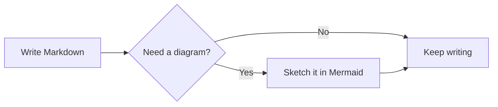
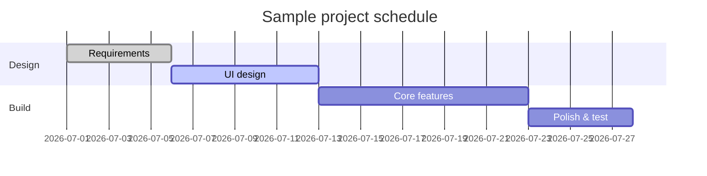
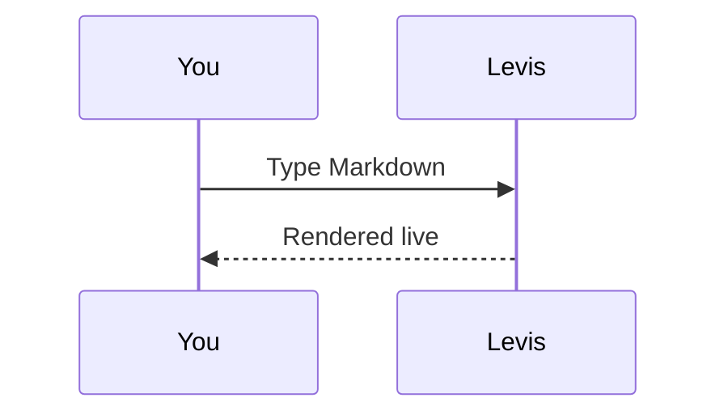

# Levis Markdown Guide

Welcome! This built-in document demonstrates the Markdown rendering Levis supports. It is just an unsaved draft — feel free to edit and experiment, then close it without saving.

> [!TIP]
> Press `Cmd+/` to toggle between WYSIWYG and source mode and see the raw syntax behind any example here.

## Inline marks

**Bold** (`**text**`), *italic* (`*text*`), ***bold italic***, ~~strikethrough~~ (`~~text~~`), ==highlight== (`==text==`), and `inline code`.

Links look like this: [the Levis repository](https://github.com/CatVinci-Studio/Levis). Inline HTML renders too, e.g. keyboard keys <kbd>Cmd</kbd> + <kbd>S</kbd>.

Inline math: mass–energy equivalence $E = mc^2$, Euler's identity $e^{i\pi} + 1 = 0$.

## Headings and quotes

The lines above are level-1 and level-2 headings (`#`, `##`). A blockquote:

> Quoted text can nest other marks, like **bold** and `code`.

GitHub-style alerts:

> [!NOTE]
> A note, for extra context.

> [!WARNING]
> A warning, for things to watch out for.

## Lists

- Unordered list
- With nesting
  - A second-level item
  - Another one

1. Ordered list
2. Second item

Task list (click a checkbox to toggle it):

- [x] Something done
- [ ] Something to do

## Tables

| Feature | Syntax | Result |
| --- | --- | --- |
| Bold | `**text**` | **text** |
| Highlight | `==text==` | ==text== |
| Inline math | `$x^2$` | $x^2$ |

Hover over a table to add or remove rows and columns.

## Code blocks

Fenced code blocks with syntax highlighting (switch the language from the block's top-right corner):

```python
def fib(n: int) -> int:
    """The classic Fibonacci sequence."""
    a, b = 0, 1
    for _ in range(n):
        a, b = b, a + b
    return a
```

```rust
fn main() {
    let greeting = "Hello, Levis!";
    println!("{greeting}");
}
```

## Math blocks

Block formulas wrapped in `$$` are rendered by KaTeX:

$$
\int_{-\infty}^{\infty} e^{-x^2} \, dx = \sqrt{\pi}
$$

## Diagrams (Mermaid)

A ```` ```mermaid ```` code block renders as a live diagram. A flowchart:



A Gantt chart:



A sequence diagram:



## Images

Paste an image straight from the clipboard — Levis saves it to an `assets/` folder next to the document and inserts the reference. Or write it by hand:

```markdown

```

## Footnotes and rules

Footnotes look like this[^1], and below is a horizontal rule:

---

[^1]: Footnote content is collected at the end of the document.

Happy writing!
