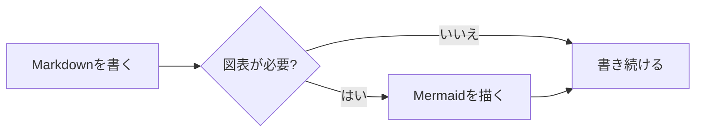
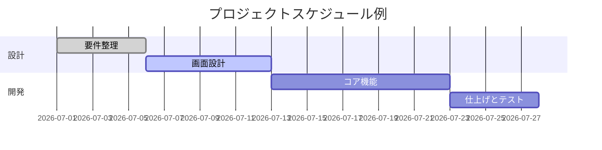
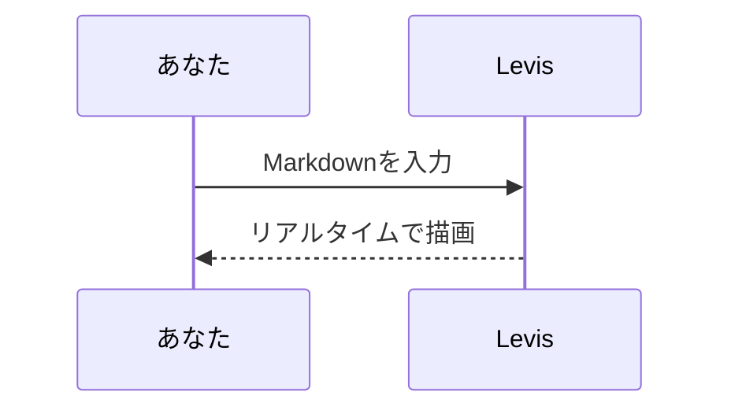

# Levis Markdown ガイド

ようこそ!これはLevisが対応するMarkdownレンダリング機能を紹介する、内蔵のデモ文書です。これは保存されていない草稿なので、自由に編集して試してかまいません —— 閉じるときに保存しなければそれで大丈夫です。

> [!TIP]
> `Cmd+/` でWYSIWYGとソースコードモードを切り替えられます。どの例も元の書き方を見比べてみてください。

## インライン記法

**太字**、*斜体*、***太字斜体***、~~取り消し線~~、==ハイライト==、そして `インラインコード`。

リンクの書き方:[Levis リポジトリ](https://github.com/CatVinci-Studio/Levis)。インラインHTMLも描画されます。例えばキーボードキー <kbd>Cmd</kbd> + <kbd>S</kbd>。

インライン数式:質量とエネルギーの関係式 $E = mc^2$、オイラーの等式 $e^{i\pi} + 1 = 0$。

## 見出しと引用

上にあるのがレベル1・レベル2の見出しです。引用ブロック:

> 引用文の中には **太字** や `コード` など他の記法もネストできます。

GitHub形式のアラートブロック:

> [!NOTE]
> これは補足説明に適したノートです。

> [!WARNING]
> これは注意すべき点を伝える警告です。

## リスト

- 箇条書きリスト
- ネストに対応
  - 2階層目の項目
  - もう1つの2階層目の項目

1. 番号付きリスト
2. 2番目の項目

タスクリスト(チェックボックスをクリックするだけで切り替え可能):

- [x] 完了した項目
- [ ] 未完了の項目

## 表

| 機能 | 記法 | 結果 |
| --- | --- | --- |
| 太字 | `**テキスト**` | **テキスト** |
| ハイライト | `==テキスト==` | ==テキスト== |
| インライン数式 | `$x^2$` | $x^2$ |

表の上にマウスを乗せると行・列の追加や削除ができます。

## コードブロック

シンタックスハイライト付きのフェンスコードブロック(右上で言語を切り替え可能):

```python
def fib(n: int) -> int:
    """お馴染みのフィボナッチ数列。"""
    a, b = 0, 1
    for _ in range(n):
        a, b = b, a + b
    return a
```

```rust
fn main() {
    let greeting = "こんにちは、Levis!";
    println!("{greeting}");
}
```

## 数式ブロック

`$$` で囲んだブロック数式はKaTeXによって描画されます:

$$
\int_{-\infty}^{\infty} e^{-x^2} \, dx = \sqrt{\pi}
$$

## 図表(Mermaid)

`mermaid` コードブロックはリアルタイムで図表に描画されます。フローチャート:



ガントチャート:



シーケンス図:



## 画像

クリップボードから画像を直接貼り付けると、Levisは文書のそばの `assets/` ディレクトリに保存して参照を挿入します。手書きすることもできます:

```markdown

```

## 脚注と区切り線

脚注はこのように書きます[^1]。以下は水平区切り線です:

---

[^1]: 脚注の内容は文書の末尾にまとめて表示されます。

執筆を楽しんで!
