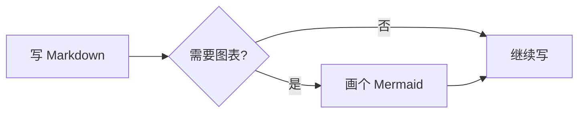
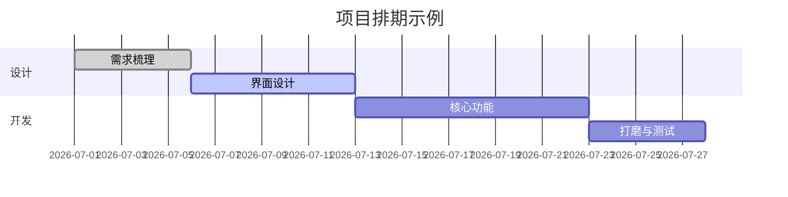
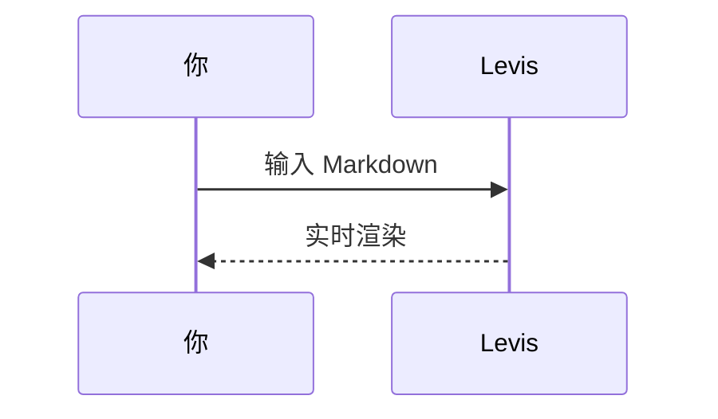

# Levis Markdown 指南

这份文档展示 Levis 支持的 Markdown 格式。可以直接编辑示例；关闭时选择不保存即可。

> [!TIP]
> 按 `Cmd+/` 切换编辑视图与源码视图，查看示例的写法。Windows 和 Linux 使用 `Ctrl+/`；修改过快捷键时，以设置中的配置为准。

## 标题与引用

行首输入 `#` 加空格创建一级标题，输入 `##` 加空格创建二级标题。本文上方的标题就是实际效果。

引用块：

> 引用的文字可以嵌套其他标记,比如 **粗体** 和 `代码`。

GitHub 风格的提示块：

> [!NOTE]
> 这是一条备注,适合补充说明。

> [!WARNING]
> 这是一条警告,提醒需要留意的地方。

## 行内样式

**粗体**、*斜体*、***粗斜体***、~~删除线~~、==高亮==，以及 `行内代码`。

链接写法：[Levis 仓库](https://github.com/CatVinci-Studio/Levis)。行内 HTML 也会渲染，比如键盘按键 <kbd>Cmd</kbd> + <kbd>S</kbd>。

行内数学公式：质能方程 $E = mc^2$，欧拉恒等式 $e^{i\pi} + 1 = 0$。

## 列表

- 无序列表
- 支持嵌套
  - 二级条目
  - 另一个二级条目

1. 有序列表
2. 第二项

任务清单(直接点击勾选框即可切换):

- [x] 已完成的事项
- [ ] 待办事项

## 表格

| 功能 | 语法 | 效果 |
| --- | --- | --- |
| 粗体 | `**文字**` | **文字** |
| 高亮 | `==文字==` | ==文字== |
| 行内公式 | `$x^2$` | $x^2$ |

把鼠标悬停在表格上可以增删行列。

## 代码块

带语法高亮的围栏代码块(在代码块右上角可切换语言):

```python
def fib(n: int) -> int:
    """经典的斐波那契数列。"""
    a, b = 0, 1
    for _ in range(n):
        a, b = b, a + b
    return a
```

```rust
fn main() {
    let greeting = "你好,Levis!";
    println!("{greeting}");
}
```

## 数学公式块

用 `$$` 包裹的块级公式由 KaTeX 渲染:

$$
\int_{-\infty}^{\infty} e^{-x^2} \, dx = \sqrt{\pi}
$$

## 图表(Mermaid)

`mermaid` 代码块会实时渲染成图表。流程图:



甘特图:



时序图:



## 图片

从剪贴板直接粘贴图片,Levis 会把它保存到文档旁的 `assets/` 目录并插入引用;也可以手写:

也可以前往**设置 → 编辑与外观 → 图片**，让之后粘贴的图片上传到自己的图床。上传接口通过 `multipart/form-data` 的 `file` 字段接收图片，可以直接返回公开 URL，也可以把 URL 放在可配置的 JSON 字段中。上传文件可以自动重命名、保留原名，或在每次上传前弹窗询问。切换存储方式不会修改已有的图片引用。

```markdown

```

## 脚注与分隔线

脚注写法像这样[^1],下面是一条水平分隔线:

---

[^1]: 脚注内容会集中显示在文档末尾。

祝写作愉快!
